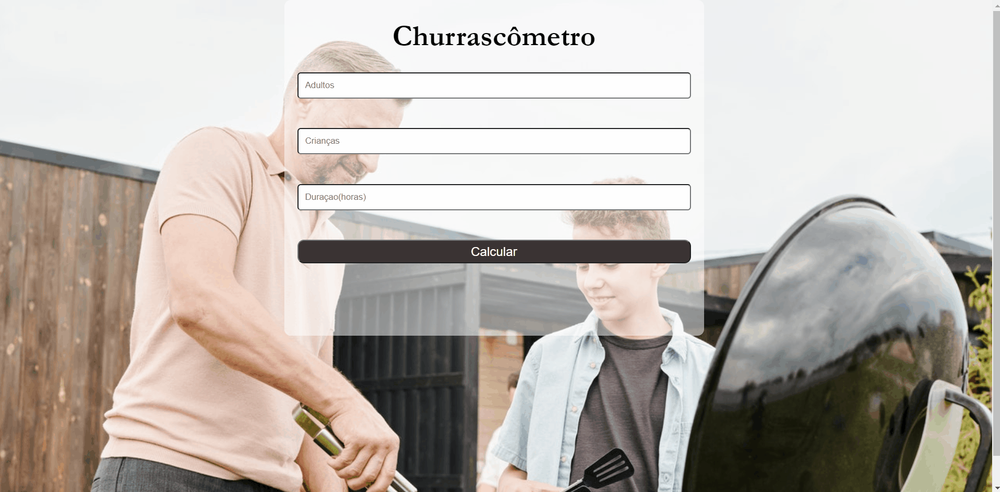

<h1>Churrascômetro</h1>

Essa página Web destina-se a ajudar os usuários a calcular o quanto de carnes e bebidas são necessários para um churrasco dado o número de pessoas e a duração do evento.

 

    <a href="#Features">Features</a> -
    <a href="#Demonstração">Desmonstração</a> -
    <a href="#Pré-requisitos">Pré Requisitos</a> -
    <a href="#tecnologias">Tecnologias</a> -
    <a href="#autor">Autor</a> 

 

# Features
- [x] Calcula o quanto será necessário para a festa.
- [x] Evita desperdícios ou a falta de alimentos.

# Demonstração

<h1 align="center">
    
</h1>

# Pré requisitos

- Para executar o sistema será necessário apenas um navegador instalado na máquina.

- Para a edição do código é importante ter instalado o VS Code.

# Tecnologias

- JavaScript
- CSS3
- HTML5

# Autor

- Desenvolvido por Edney Mendes
- [Veja meu Linkedin](https://www.linkedin.com/in/edney-mendes-372545224/)